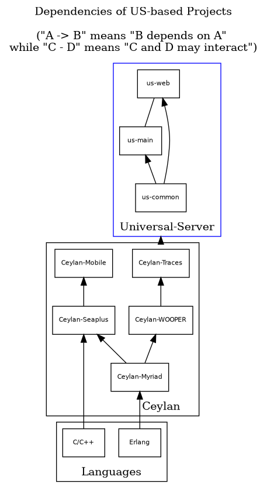

# Universal-Server
The **Universal-Server project** (`US`) has for goal to provide an infrastructure able to support a wide range of computer-based services.

This **US** project currently comprises 3 public sub-projects:
 - [us-common](https://github.com/Olivier-Boudeville/us-common): for all the **base facilities** on which the various Universal Services are built
 - [us-main](https://github.com/Olivier-Boudeville/us-main): for the **Universal Server** itself, the main daemon involved 
 - [us-web](https://github.com/Olivier-Boudeville/us-web): for the **Universal Webserver**, which is a multi-domain, multi-virtualhost webserver
  

The US infrastructure depends on the [Ceylan](https://github.com/Olivier-Boudeville/Ceylan) one.

This repository is just an umbrella, in the sense it is mostly empty: its purpose is only to federate and give access to the US-* actual subprojects. 

